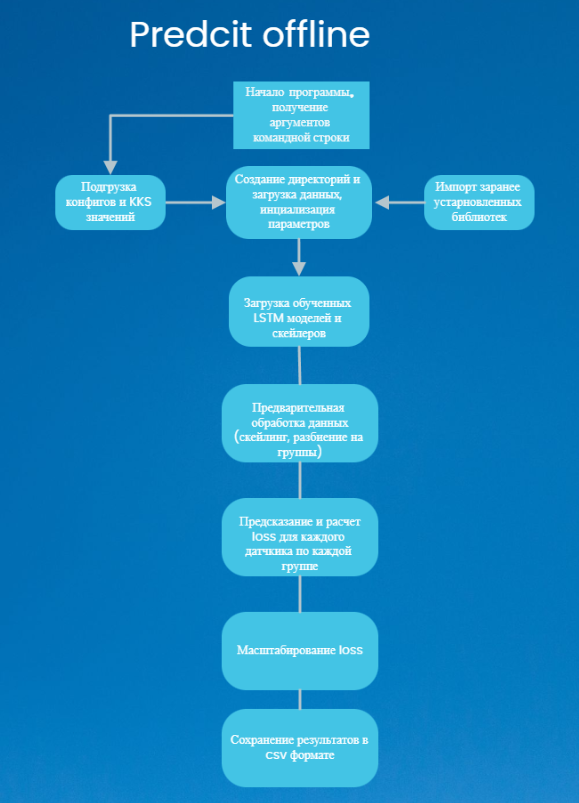

## Основное описание



Для набора данных проекта программа предварительно обрабатывает его, загружает модели, использует их для прогнозирования аномалий, обнаруживает их и создает отчет в формате JSON.

### Системные требования

- pandas==1.3.4
- tensorflow==2.12.0
- joblib==1.1.0
- loguru==0.5.3
- sklearn==0.22.2.post1
- scipy==1.3.3
- clickhouse-driver==0.2.5

### Как установить

```
pip install -r requirements.txt
```

## Как использовать

### Использование аргументов командной строки

Эта программа может принимать следующие аргументы командной строки:

- `--config_path` - путь к YAML файлу конфигурации. (по умолчанию: '')
- `--file_format` - Формат входных данных: db, csv, sqlite. (по умолчанию: db)
- `--csv_kks` - Путь к csv-файлу сконфигурированной группы kks. (по умолчанию: False)

Запустите следующую команду для запуска программы:

    python predict_offline.py --config_path=path/to/config --file_format=db --csv_kks=False

Обязательными аргументами являются путь к файлу конфигурации (`--config_path`), формат входных данных (`--file_format`), который может иметь следующие значения csv,json и SQLite, а также путь к файлу сконфигурированной группы KKS (`--csv_kks`), который может иметь значение `False` или путь к csv-файлу.

### Пример запуска

```
python predcit_offline.py --config_path SOCHI
```

### Ожидаемые результаты

Программа обрабатывает набор данных, прогнозирует аномалии, обнаруживает их и сохраняет отчет в JSON-файл.

### Конфигурация

Программу можно настроить с помощью файла `config_offline.yaml`, который содержит следующие параметры:

`NUM_GROUPS`: это количество групп в наборе данных.

`KKS`: это файл, содержащий KKS.

`WEIGHTS`: здесь указан каталог для весов модели.

`SCALER`: здесь указан каталог для масштабов модели.

`LAG`: это задержка прогнозирования для модели.

`ROLLING_MEAN`: это логическое значение, которое позволяет скользящее среднее данных.

`EXP_SMOOTH`: это логическое значение, которое позволяет экспоненциально сглаживать данные.

`DOUBLE_EXP_SMOOTH`: это логическое значение, которое позволяет двухэтапное экспоненциально сглаживание данных.

`ROLLING_MEAN_WINDOW`: это указывает размер окна для скользящего среднего.

`ROLLING_MEAN_LOSS`: это размер скользящего окна для целевого значения.

`LEN_LONG_ANOMALY`: это настройка определяет минимальную длину длинного обнаруженного интервала аномалии.

`LEN_SHORT_ANOMALY`: это настройка определяет минимальную длину короткого обнаруженного интервала аномалии.

`COUNT_CONTINUE_SHORT`: количество отсчетов для пррывания короткого интервала

`COUNT_CONTINUE_LONG`: количество отсчетов для пррывания длинного интервала

`SHORT_TRESHOLD`: порог для определения аномального значения для поиска коротких интервалов

`LONG_TRESHOLD`: порог для определения аномального значения для поиска длинных интервалов

`COUNT_TOP`: это количество датчиков, которые будут записаны в отчет.

`POWER_ID`: это индекс столбца мощности в наборе данных.

`POWER_LIMIT`: это задает предел для набора данных.

`POWER_FILL`:  Мод для заполнения функции ошибки при мощности ниже лимита. Значение `zeroes` заполняет нулями.  Значение `last_value` заполняет последним значением

`MEAN_NAN`: это логическое значение, которое позволяет использовать среднее значение при предварительной обработке NA-значений в наборе данных.

`DROP_NAN`: это логическое значение, которое позволяет удалить строки, которые содержат пустые ячейки.

`AUTO_DROP_LIST`: это логическое значение, которое удаляет датчики нулевой группы из отчета csv.

`CSV_SAVE_RESULT`: это каталог, который содержит результат.

`CSV_DATA`: это каталог, который содержит исходный набор данных.

`JSON_DATA`: это каталог, который содержит выходной отчет JSON.

`TEST_FILE`: Указывается способ получения данных, возможны форматы: запрос к бд, sqlite, csv.

`DROP_LIST`: это список датчиков, которые нужно удалить из отчета.

## Общий Алгоритм

1. Импорт необходимых библиотек и модулей.
2. Установка конфигурации TensorFlow и использование argparse для получения аргументов командной строки.
3. Определение функции `set_tf_config()`, которая настраивает конфигурацию TensorFlow для использования GPU и динамического распределения памяти.
4. Определение функции `get_options()`, которая использует argparse для получения аргументов командной строки, таких как путь к конфигурационному файлу, формат файла данных и другие опции.
5. Определение функции `ensure_directories_exist()`, которая создает необходимые директории для сохранения результатов работы программы.
6. Определение функции `load_dataset()`, которая загружает данные из базы данных, CSV-файла или SQLite-базы данных в зависимости от указанного формата файла данных.
7. Определение функции `load_models_and_scalers()`, которая загружает предварительно обученные модели и скейлеры из файлов.
8. Определение функции `load_groups()`, которая загружает группы объектов из базы данных или CSV-файла.
9. Определение функции `preprocess_data()`, которая выполняет предварительную обработку данных, включая фильтрацию, заполнение пропущенных значений, применение скользящего среднего и экспоненциального сглаживания.
10. Определение функции `main()`, которая содержит основную логику программы.
11. Загрузка конфигурации из файла YAML с помощью функции `load_config()`.
12. Создание необходимых директорий для сохранения результатов работы программы с использованием функции `ensure_directories_exist()`.
13. Загрузка тестовых данных с использованием функции `load_dataset()`.
14. Загрузка предварительно обученных моделей и скейлеров с использованием функции `load_models_and_scalers()`.
15. Загрузка групп объектов с использованием функции `load_groups()`.
16. Предварительная обработка данных с использованием функции `preprocess_data()`, включая фильтрацию, заполнение пропущенных значений и преобразование данных.
17. Итерация по группам объектов:

    - Подготовка данных для текущей группы объектов.
    - Преобразование данных с использованием соответствующего скейлера.
    - Применение предварительно обученной модели для получения прогноза.
    - Расчет ошибки между прогнозом и фактическими значениями.
    - Масштабирование ошибки с использованием соответствующего скейлера потерь.
    - Создание DataFrame с результатами для текущей группы объектов.
    - Сохранение DataFrame с результатами в файл.
18. Окончание программы.

### Алгоритм выделения интервалов

Алгоритм выделения основан на поиске коротких и длинных интервалов Суть метода в том выделяются интервалы разной длины(для коротких порог (`SHORT_TRESHOLD`) больше ограничение по длине меньше (`LEN_SHORT_ANOMALY`),  для длинных порог (`LONG_TRESHOLD`) меньше ограничение по длине больше(`LEN_LONG_ANOMALY`)).
Для того чтобы избежать резкого обрыва интервала введены параметры `COUNT_CONTINUE_SHORT` для коротких интервалов и `COUNT_CONTINUE_LONG`. Количетсво отсчетов указаных в данных параметров показывает через сколько нужно прервать интервал если не находится аномальных значений.
